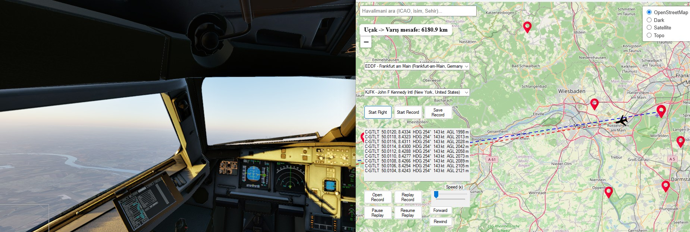
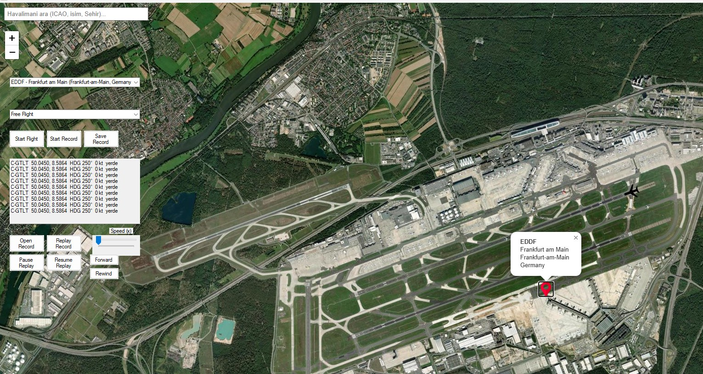
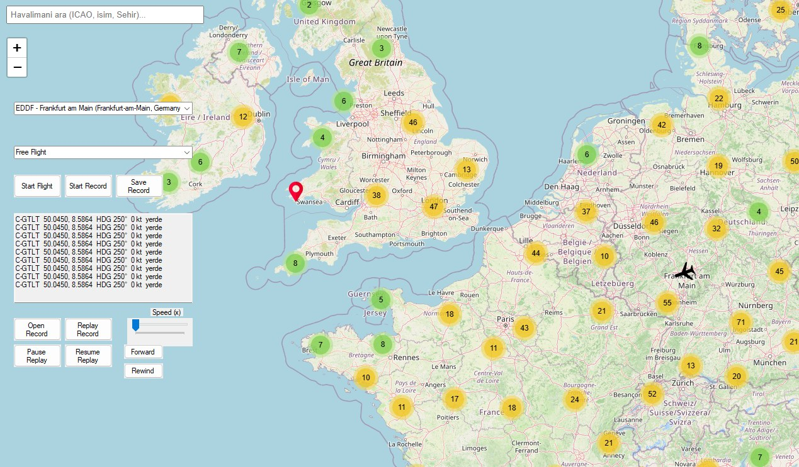

# X-Plane Flight Tracker

Live flight tracking for X-Plane. A C++ plugin running inside the simulator streams aircraft data over UDP to a Windows desktop app, which shows the aircraft on a map, records the flight and replays it.



<p>
  
  
</p>

## Features

- **X-Plane plugin (C++, X-Plane SDK).** Registers a flight loop callback and sends a packet every 0.1 s with 30+ values: position, altitude, height above ground, heading, airspeed, tail number, aircraft model, simulator time and aircraft system states (parking brake, battery, gear handle, engine fire, lights, flaps, speedbrake, pitot heat, anti-ice…), including two Zibo 737–specific datarefs.
- **Live map (C#, WinForms + WebView2 + Leaflet).** The aircraft marker follows the simulator and rotates with the heading. OpenStreetMap, dark, satellite and topographic layers.
- **Airports.** About 16,000 airports generated from X-Plane's own airport database, clustered on the map and searchable by ICAO code, name or city.
- **Route.** Pick departure and arrival airports to draw the route and show the remaining distance.
- **Flight recording and replay.** Save a flight as CSV or JSON and replay it with pause, speed control, forward and rewind.
- **Voice callouts** using Windows speech synthesis (for example after lift-off).

### DataRef Monitor

A separate in-sim tool (`MyXPlanePlugin/`) built with Dear ImGui. It watches datarefs while you operate the cockpit, lists the ones that change, and exports the captured list to a text file. Useful for finding which dataref a switch or button drives when an aircraft's documentation is limited.

## Architecture

```
 X-Plane ── XPlaneMapPlugin (C++, win.xpl) ── UDP :49001 ──►  XPlaneMapReceiver (C#, WinForms)
                                                                └── WebView2 ── map.html (Leaflet)
```

Each UDP packet is one line of 32 comma-separated fields; the field order is defined in `XPlaneMapPlugin.cpp` and mirrored in `Form1.cs`.

| Folder | Contents |
|---|---|
| `XPlaneMapPlugin/` | X-Plane plugin (C++, Visual Studio) |
| `XPlaneMapReceiver/` | Desktop map app (C#, .NET Framework 4.8) |
| `MyXPlanePlugin/` | DataRef Monitor plugin (C++, Dear ImGui) |
| `tools/` | Airport data generator |

## Getting started

Requirements: Windows, X-Plane 11 or 12, Visual Studio 2022 (C++ and .NET desktop workloads), the [X-Plane SDK](https://developer.x-plane.com/sdk/), Python 3, and the WebView2 Runtime (included with Windows 11).

1. **Configure paths.** Copy `xplane.local.props.example` to `xplane.local.props` and set your X-Plane folder and SDK path.
2. **Build the plugin.** Open `XPlaneMapPlugin/XPlaneMapPlugin.sln` and build `Release | x64`. The plugin is copied to `X-Plane/Resources/plugins/MapPlugin/64/win.xpl`. The DataRef Monitor in `MyXPlanePlugin/` builds the same way and is copied to `plugins/DataRefMonitor`.
3. **Generate the airport data** from your X-Plane installation:
   ```bash
   python tools/build_airports.py "<X-Plane 12>/Global Scenery/Global Airports/Earth nav data/apt.dat"
   ```
4. **Build and run the app.** Open `XPlaneMapReceiver/XPlaneMapReceiver.sln`, let Visual Studio restore the NuGet packages, and run it.
5. Start a flight in X-Plane; the aircraft appears on the map.

## Status

Personal hobby project, built in 2025 on X-Plane 11 and updated for X-Plane 12. Some interface text and voice prompts are in Turkish.

## Third-party

- [Dear ImGui](https://github.com/ocornut/imgui) 1.90.1 (MIT), included in `MyXPlanePlugin/` with its license.
- [Leaflet](https://leafletjs.com/), [Leaflet.markercluster](https://github.com/Leaflet/Leaflet.markercluster) and [leaflet-rotatedmarker](https://github.com/bbecquet/Leaflet.RotatedMarker), loaded from unpkg.
- Map tiles from OpenStreetMap, OpenTopoMap and Esri.
- The X-Plane SDK and the airport data (derived from X-Plane's `apt.dat`) are not included in this repository.

## License

All rights reserved. The source is published for viewing; please contact me before reusing it.
